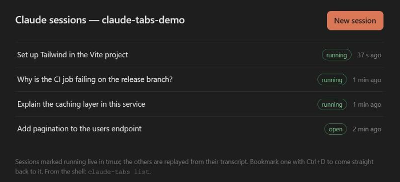
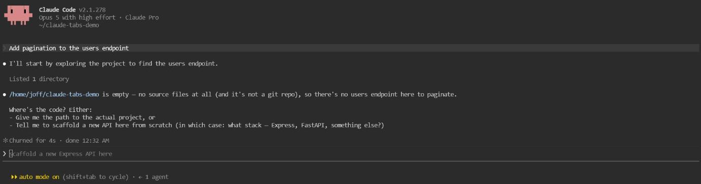

# claude-tabs

One browser tab per Claude Code conversation. Every conversation gets a stable
address you can bookmark, it survives the tab being closed thanks to tmux, and it
is replayed from its transcript after a reboot, because the identifier in the URL
*is* the Claude session id.

This is not another chat interface built on top of the SDK: the tab runs the real
Claude Code terminal UI, served by [ttyd](https://github.com/tsl0922/ttyd), with
every keystroke, picker and slash command exactly as in your shell.





Built on WSL2, but nothing in it is specific to that: any Linux with ttyd, tmux
and Python 3 will do.

**Status: 0.1.0, pre-1.0.** It works and is in daily use, but the URL scheme, the
command names and the layout of `~/.config/claude-tabs` may still change from one
0.x release to the next. Pin a tag if you need it to stay put.

## What you get

| Address | What it does |
| --- | --- |
| `http://localhost:7681/new` | starts a conversation and redirects to its permanent address |
| `http://localhost:7681/resume` | lists your conversations, running and stored |
| `http://localhost:7681/?arg=<uuid>` | the conversation itself — the address to bookmark |
| `http://localhost:7681/` | redirects to `/resume` |
| `http://localhost:7681/title?id=<uuid>` | a conversation's name, as JSON |

Reloading a conversation's tab reattaches it instead of opening a second one,
and restarting the servers leaves both the conversations and the tabs alone: the
tmux server lives outside the two services, and a tab whose connection drops
waits for them to answer, then reloads itself and reattaches. The tab is named
after the conversation, using the name Claude gives it, so a fresh session
starts out as `claude 6ccdc448` and renames itself once it has a subject.
Rename a conversation or switch to another one from inside the tab and the tab
name follows, because the name is read from the session registry Claude keeps in
`~/.claude/sessions`, not from the address bar.

## Requirements

```bash
sudo apt install ttyd tmux python3
```

Claude Code must be installed and reachable in `PATH` as `claude`.

## Install

```bash
git clone https://github.com/joffreco/claude-tabs
./claude-tabs/install.sh
claude-tabs start
```

The installer asks which directory the sessions should run in, and defaults to
your home directory. Claude keeps one transcript directory per working directory,
so this choice also decides which conversations `/resume` lists: point it at a
single project and you get that project's conversations and nothing else, point it
at `~` and you get the ones you started from `~`. Change it at any time by running
`install.sh` again. The four scripts are symlinked into `~/.local/bin`,
the tmux configuration into `~/.config/claude-tabs`, and the systemd units are
copied into `~/.config/systemd/user`. Editing a script in the repository takes
effect immediately; editing a unit means running `install.sh` again.

## Starting it automatically

With systemd running:

```bash
systemctl --user enable --now claude-tabs-ttyd.service claude-tabs.service
loginctl enable-linger "$USER"
```

On WSL2, systemd is off by default. Add these lines to `/etc/wsl.conf`, then run
`wsl --shutdown` from PowerShell before reopening the distribution:

```ini
[boot]
systemd=true
```

Without systemd, `claude-tabs start` simply runs the two processes in the
background.

## Commands

```
claude-tabs start      start the stack (through systemd when it is running)
claude-tabs stop       stop the servers; the tmux conversations keep running
claude-tabs restart    both of the above
claude-tabs status     state of the two processes
claude-tabs new        print the address that creates a conversation
claude-tabs list       the running conversations, with their addresses
claude-tabs kill <id>  end one conversation
claude-tabs version    print the installed version
```

## How it is built

```
browser ──▶ claude-tabs-front (Python, 127.0.0.1:7681)
              ├── /new, /resume, /title : answered here
              ├── the terminal page     : relayed, plus a script that names the tab
              │                           and brings it back after an outage
              └── everything else       : spliced onto ttyd, websocket included
                     │
                     ▼
           ttyd (127.0.0.1:7682, --url-arg)
                     │  runs, for every tab:
                     ▼
           claude-tabs-session <uuid>
                     │  validates the id, picks --session-id or --resume
                     ▼
           tmux -L claude-tabs  ──▶  claude
             server in claude-tabs-tmux.scope, outside the two services
```

The front end uses nothing but the Python standard library, so it runs on
`/usr/bin/python3` without depending on a Node version or a third-party package
manager. The tmux server has a socket name of its own (`-L claude-tabs`), which
leaves the tmux you use elsewhere untouched.

The first tab starts that server through `systemd-run --user --scope`, in a
control group of its own, `claude-tabs-tmux.scope`. Without it the server would
be born as a child of ttyd, inside the service's control group, and systemd
kills a whole group when it stops a unit: restarting the servers would end every
conversation at once. Apart, the server survives `claude-tabs restart` and a
crash of ttyd, and ends only when its last conversation does.

## Settings

All four scripts read the same variables, either from the environment or from
`~/.config/claude-tabs/env`, which `install.sh` writes:

| Variable | Default | Meaning |
| --- | --- | --- |
| `CLAUDE_TABS_PORT` | `7681` | the front end's port, the one you browse to |
| `CLAUDE_TABS_TTYD_PORT` | `7682` | ttyd's internal port |
| `CLAUDE_TABS_DIR` | `$HOME` | working directory of the Claude sessions |

The ports are also written into the systemd units, so change them in both places.

## Troubleshooting

**A tab reloads endlessly.** The process started for it is exiting immediately, and
the ttyd client reconnects each time. `claude-tabs-run` holds the terminal open and
prints the reason instead of vanishing, and
`journalctl --user -u claude-tabs-ttyd.service` shows the history of launches. The
usual cause is `PATH`: a user service does not inherit your shell's, so `claude`
installed in `~/.local/bin` is invisible to it. That is what the
`Environment=PATH=` line in `claude-tabs-ttyd.service` is for.

**A tab shows "Press ⏎ to Reconnect".** That is ttyd's own message, and the tab
should not stop there: the injected script waits for the servers and reloads the
page by itself, which reattaches the conversation still running in tmux. Seeing
it stay means the page was served by an older version — a hard reload
(Ctrl+Shift+R) picks up the current one — or that the front end is down as well,
in which case the tab has no one left to ask.

**A tab keeps its old title.** Chrome caches the terminal page; a hard reload
(Ctrl+Shift+R) picks up the current one.

**Port 7681 is already taken.** The Debian package of ttyd ships its own service,
`ttyd.service`, which publishes a login prompt. It has nothing to do with this
project and is worth disabling: `sudo systemctl disable --now ttyd.service`.

## Security

Both servers listen on `127.0.0.1` only, so nothing is exposed to the network.
ttyd's `--url-arg` lets the browser pass arguments to the command it runs, which is
why `claude-tabs-session` refuses anything that is not a well-formed UUID before
executing anything. If you expose this beyond the machine, add authentication
(`ttyd --credential`) and an encrypted tunnel: as it stands, whoever reaches the
port gets a shell.

## Uninstall

```bash
./claude-tabs/uninstall.sh
```

Your conversation transcripts, under `~/.claude/projects`, are left untouched.

## License

MIT. Not affiliated with Anthropic; Claude and Claude Code are their trademarks.
